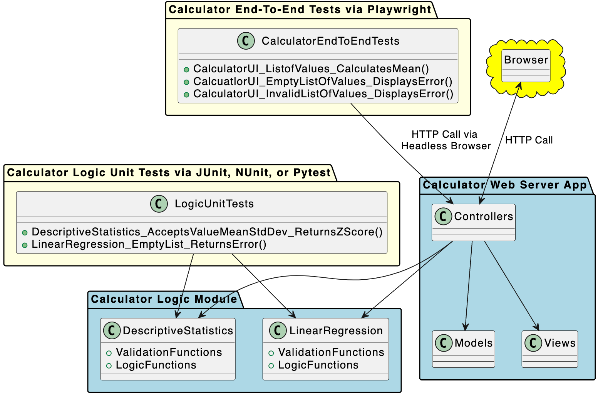
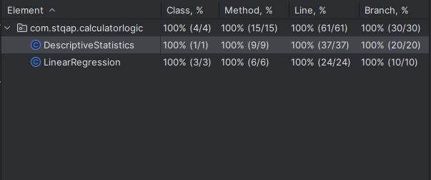

# KSU SWE 3643 Software Testing and Quality Assurance Semester Project: Web-Based Calculator

A web-based calculator application that performs statistics calculations. This calculator supports mean, standard deviation, z-score, and linear regression calculations with robust error handling and validation.

## Table of Contents
- [Team Members](#team-members)
- [Architecture](#architecture)
- [Environment](#environment)
- [Executing the Web Application](#executing-the-web-application)
- [Executing Unit Tests](#executing-unit-tests)
- [Reviewing Unit Test Coverage](#reviewing-unit-test-coverage)
- [Executing End-to-End Tests](#executing-end-to-end-tests)
- [Final Video Presentation](#final-video-presentation)

## Team Members
Nathan Onyechie

## Architecture
The application follows a modular architecture with clear separation of Logic and UI as stated by the rubric:



The project is divided into four main modules:
1. Calculator Logic Module (`/src/calculator-logic`)
   - Contains DescriptiveStatistics and LinearRegression classes
   - Handles all calculation logic
   - No UI dependencies
2. Web Application (`/src/web`)
   - Spring Boot web interface
   - References calculator logic
   - MVC pattern implementation
3. Unit Tests (`/src/tests`)
   - JUnit tests for calculator logic
   - 100% code coverage
4. End-to-End Tests (`/src/e2e`)
   - Playwright tests for web interface
   - Tests all calculator functions

## Environment
This is a cross-platform Java application that should work on Windows, macOS, and Linux. The application has been tested on Windows.

Prerequisites:
1. Java JDK 21 or newer
2. Maven 3.5+
3. Node.js (for Playwright tests)
4. Chrome/Chromium browser

To set up your environment:
```bash
# Install dependencies for Playwright
cd src/e2e
npm install
npx playwright install
```

## Executing the Web Application
To build and run the application:

```bash
# First, navigate to your root project directory:
cd C:\yourpath\SWE-QA-Project\swe-qa-project

# From project root
mvn clean package

# Install all modules first:
mvn clean install

# Start the application
cd src/web
mvn spring-boot:run
```

The application will be available at http://localhost:8080

Common Issues:
- If port 8080 is already in use, modify `application.properties` to use a different port
- Make sure Java 21+ is installed and JAVA_HOME is set correctly

## Executing Unit Tests
To run the unit tests:

```bash
# From project root
cd src/tests
mvn test
```

Sample output:
```
[INFO] Tests run: 32, Failures: 0, Errors: 0, Skipped: 0
[INFO] BUILD SUCCESS
```

## Reviewing Unit Test Coverage
Unit test coverage for calculator logic is 100% for both DescriptiveStatistics.java and LinearRegression.java:



The test suite includes coverage of:
- Valid input cases
- Edge cases
- Error conditions
- Lambda expressions

## Executing End-to-End Tests
To run the end-to-end tests:

1. Start the application in one terminal:
```bash
cd src/web
mvn spring-boot:run
```

2. Run Playwright tests in another terminal:
```bash
cd src/e2e
npx playwright test
```

The tests will run in headless mode and generate a report. View the report with:
```bash
npx playwright show-report
```

## Final Video Presentation
(https://youtu.be/yJ1c-emGPUw)
